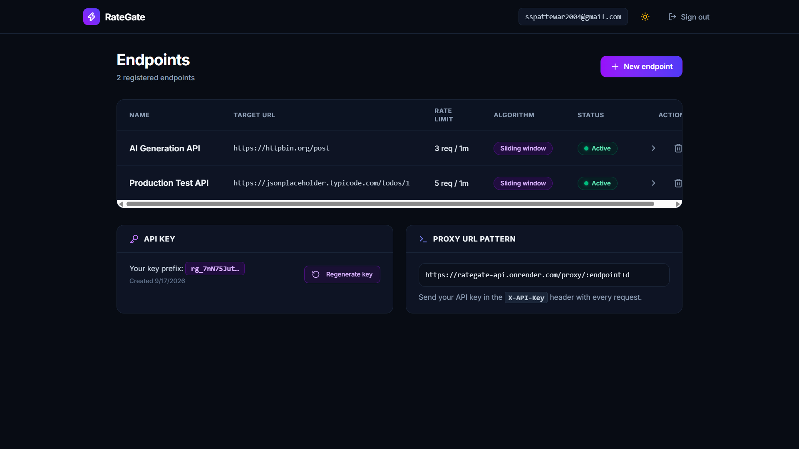
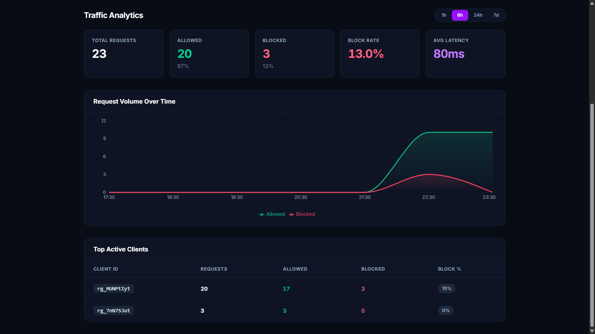
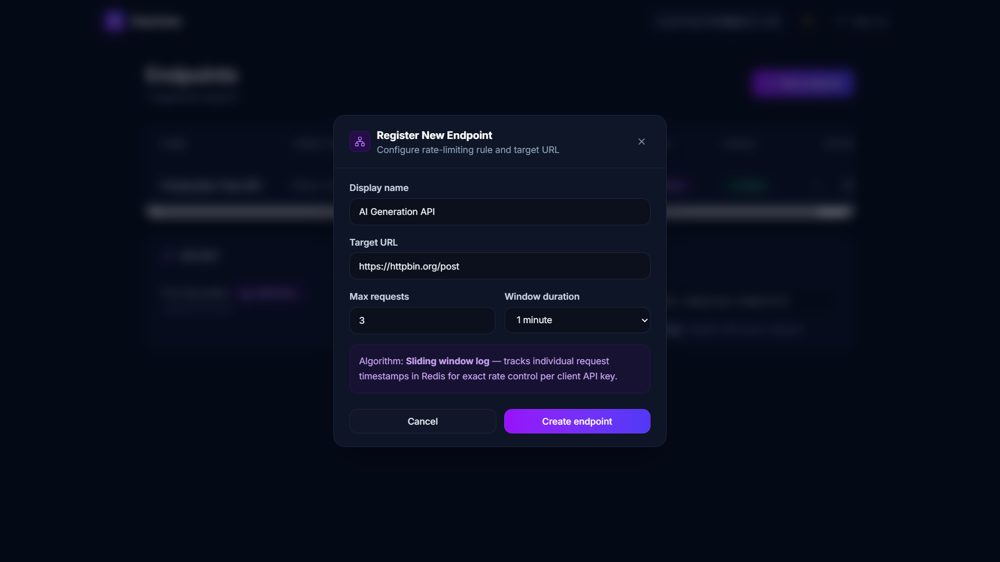
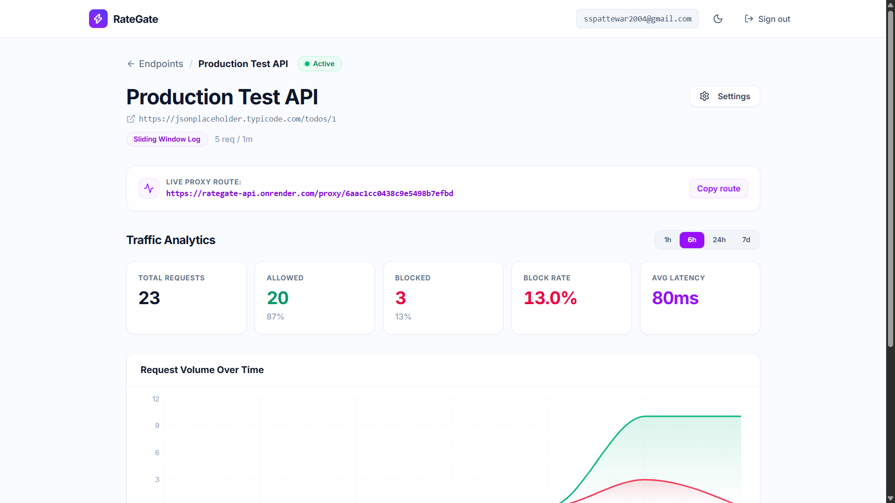
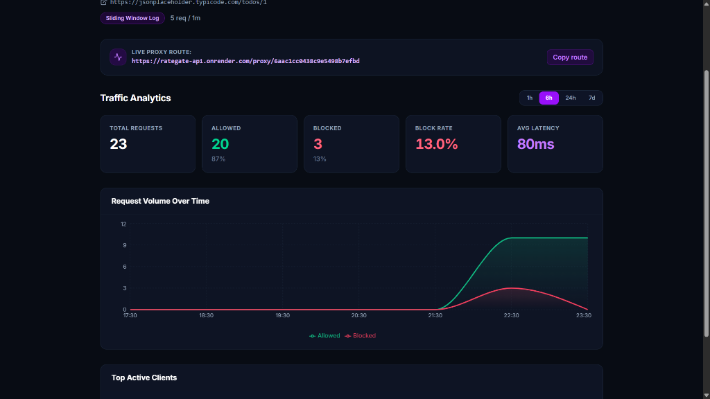
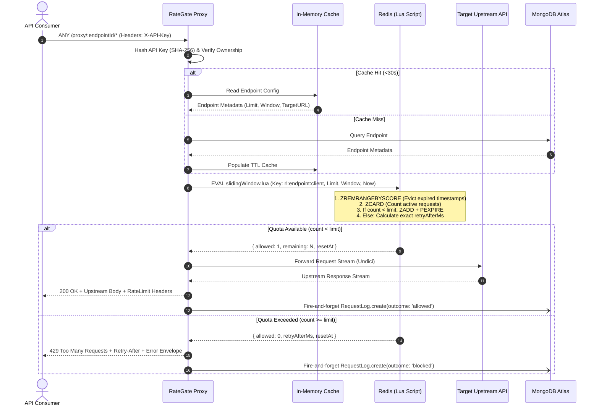

# ⚡ RateGate — Distributed Rate-Limiter as a Service (RLaaS)

<p align="center">
  
  
  
  
  
  
  
  
  
</p>

<p align="center">
  <strong>High-performance, multi-tenant reverse proxy and rate-limiting gateway with sub-millisecond atomic sliding-window enforcement, live analytics, and a self-service developer dashboard.</strong>
</p>

> [!TIP]
> ### ⚡ Test the Live Reverse Proxy Gateway (Windows PowerShell)
> ```powershell
> curl.exe -i -H "X-API-Key: rg_MUNPtIytnZnLzTeTMuAJm2ByqsUX33p__rO7C_cpkXw" "https://rategate-api.onrender.com/proxy/6aac1cc0438c9e5498b7efbd"
> ```
> *(Note: Windows PowerShell requires `curl.exe` instead of `curl` to invoke the genuine cURL executable rather than the `Invoke-WebRequest` alias).*

---

## 📸 Application Showcase & Live UI

<div align="center">
  
  <p><em>Developer Dashboard — manage multi-tenant upstream endpoints, generate API keys, and copy live proxy routes.</em></p>
</div>

<br/>

<div align="center">
  
  <p><em>Real-Time Traffic Analytics — request volume timeseries (Allowed vs Blocked), average latency, and per-client audit table.</em></p>
</div>

<br/>

<table align="center" width="100%">
  <tr>
    <td align="center" width="50%">
      <strong>⚡ Instant Endpoint Registration</strong><br/><br/>
      
      <br/>
      <em>Configure sliding-window quotas with customizable limits and windows in seconds.</em>
    </td>
    <td align="center" width="50%">
      <strong>☀️ Light / Dark Mode Flexibility</strong><br/><br/>
      
      <br/>
      <em>Polished light and dark themes with tactile micro-interactions and copy route feedback.</em>
    </td>
  </tr>
</table>

<br/>

<div align="center">
  
  <p><em>Endpoint Detail (Dark Mode) — Live Proxy Route banner with animated copy button, sliding window log rules, and live metric tracking.</em></p>
</div>

---

## 🏛️ System Architecture

RateGate sits transparently between your API consumers and your upstream services. It decouples rate limiting and traffic management from upstream application code, shielding backends from traffic spikes, noisy neighbors, and DDoS attempts.

```
                              ┌──────────────────────────────────────────────┐
                              │               CLIENT APPLICATIONS            │
                              │   (Web Dashboard, Mobile Apps, 3rd Parties)  │
                              └──────────────────────┬───────────────────────┘
                                                     │ HTTP / HTTPS (X-API-Key)
                                                     ▼
┌────────────────────────────────────────────────────────────────────────────────────────────────────────┐
│                                       RATEGATE GATEWAY (Node.js/Express)                               │
│                                                                                                        │
│  ┌───────────────────────┐         ┌────────────────────────┐         ┌─────────────────────────────┐  │
│  │   Auth Middleware     │         │  In-Process TTL Cache  │         │   Sliding-Window Limiter    │  │
│  │  SHA-256 Key Lookup   │────────▶│ (30s Endpoint Cache)   │────────▶│      Redis Lua Script       │  │
│  │  Ownership & Active   │         │ (Hot Path Zero-DB Lat) │         │    (Sub-ms Atomicity)       │  │
│  └───────────────────────┘         └────────────────────────┘         └──────────────┬──────────────┘  │
│                                                                                      │                 │
│                                                       ┌──────────────────────────────┴──────────────┐  │
│                                                       │                                             │  │
│                                                 [If Allowed]                                   [If Blocked]    │
│                                                       │                                             │  │
│                                                       ▼                                             ▼  │
│                                            ┌─────────────────────┐                       ┌──────────────┐  │
│                                            │  Undici HTTP Client │                       │ HTTP 429     │  │
│                                            │  Full Duplex Stream │                       │ Retry-After  │  │
│                                            └──────────┬──────────┘                       │ Error JSON   │  │
│                                                       │                                  └──────┬───────┘  │
│                                                       │                                         │          │
│                                                       └───────────────────┬─────────────────────┘          │
│                                                                           ▼                                │
│                                                          ┌─────────────────────────────────┐               │
│                                                          │   Fire-and-Forget Async Logger  │               │
│                                                          │     (0ms Latency Overhead)      │               │
│                                                          └────────────────┬────────────────┘               │
└───────────────────────────────────────────────────────────────────────────┼────────────────────────────────┘
                                                                            │
                          ┌─────────────────────────┬───────────────────────┴────────────────────────┐
                          ▼                         ▼                                                ▼
           ┌─────────────────────────────┐ ┌────────────────────────────────┐         ┌───────────────────────────┐
           │     UPSTASH / REDIS 7       │ │     MONGODB ATLAS CLUSTER      │         │   UPSTREAM TARGET APIS    │
           │  • Sorted Sets (ZSET)       │ │  • Users & Hashed API Keys     │         │  • Internal Microservices │
           │  • Atomic Lua Execution     │ │  • Registered Endpoint Configs │         │  • Public 3rd Party APIs  │
           │  • Rolling Window Cleanup   │ │  • Analytics Logs (TTL Auto-Del)│        │  • Serverless Functions   │
           └─────────────────────────────┘ └────────────────────────────────┘         └───────────────────────────┘
```

---

## 🔄 End-to-End Request Lifecycle



---

## 🔬 Core Algorithm: Atomic Sliding Window Log

RateGate implements the **Sliding Window Log** algorithm directly inside Redis using a custom Lua script ([`slidingWindow.lua`](file:///c:/RATEGATE/server/src/services/rateLimiter/slidingWindow.lua)).

### How It Works

Every allowed request is recorded as a member in a Redis Sorted Set (`ZSET`) keyed by:
```text
rl:<endpointId>:<clientId>
```
The score of each member is its millisecond arrival timestamp (`now`).

```
                              Rolling Window (e.g. 10,000 ms)
                    ┌──────────────────────────────────────────────┐
                    │                                              │
... ───●────────────┼──────●─────────────●─────────────●───────────●───────► TIME
    Expired         │  Allowed       Allowed       Allowed       Current
  (Auto-Evicted)    │                                            Arrival
                    └──────────────────────────────────────────────┘
                    [------- Valid Quota Count (ZCARD) ------------]
```

### The Atomic Lua Script Execution

1. **Eviction**: Drops all historical entries that have slid out of the current window:
   ```lua
   redis.call('ZREMRANGEBYSCORE', key, '-inf', now - window)
   ```
2. **Cardinality Check**: Counts the exact number of remaining active timestamps:
   ```lua
   local count = redis.call('ZCARD', key)
   ```
3. **Branch A — Admit (`count < limit`)**:
   * Appends the new request timestamp and refreshes TTL:
     ```lua
     redis.call('ZADD', key, now, member)
     redis.call('PEXPIRE', key, window)
     ```
   * Returns `{ allowed = 1, remaining = limit - count - 1 }`.
4. **Branch B — Reject (`count >= limit`)**:
   * Inspects the oldest recorded timestamp to compute the exact millisecond recovery time:
     ```lua
     local oldest = redis.call('ZRANGE', key, 0, 0, 'WITHSCORES')
     local retryAfter = (tonumber(oldest[2]) + window) - now
     ```
   * **Crucial Anti-Lockout Feature**: Rejected attempts are **never written** to Redis. Aggressive retries cannot push a client's reset window further into the future.

### Algorithm Comparison

| Feature | Sliding Window Log (RateGate) | Token Bucket | Fixed Window Counter | Leaky Bucket |
|---|---|---|---|---|
| **Boundary Bursting** | **None (100% Exact)** | Allows bursting up to capacity | Up to 2× limit at boundary | None |
| **Precision** | **Sub-millisecond Exact** | Approximate (refill ticks) | Low (coarse windows) | Uniform smoothing |
| **Atomic Complexity** | **Low (Single Lua Script)** | High (Tokens + Timestamp sync) | Low | Moderate |
| **Memory Footprint** | $O(N)$ requests in window | $O(1)$ constant | $O(1)$ constant | $O(N)$ queue size |

---

## ⚡ High-Performance Engineering Decisions

### 1. Hot-Path In-Process TTL Cache
On high-volume proxy routes, querying MongoDB on every request to check endpoint existence, target URL, and rate limit rules creates a database bottleneck. RateGate uses a process-level 30-second TTL cache in [`endpoint.service.js`](file:///c:/RATEGATE/server/src/services/endpoint.service.js):
* **Hot Path**: Served entirely from Node.js RAM (0ms DB latency).
* **Cache Busting**: Updates or deletions instantly invalidate the local cache entry.

### 2. Zero-Copy Request Streaming
Rather than buffering large file uploads or payloads into Node memory, RateGate streams request and response bodies directly to and from the upstream target using **`undici`**.

### 3. Asynchronous Fire-and-Forget Logging
Analytics and audit logs (`RequestLog.create()`) are dispatched asynchronously after the client response has already flushed. Logging never adds latency to the proxy path.

### 4. Enterprise SSRF Protection
With `ALLOW_PRIVATE_TARGETS=false` in production, RateGate validates target URLs via Zod and blocks internal IP ranges (`127.0.0.1`, `localhost`, `10.0.0.0/8`, `192.168.0.0/16`) to prevent Server-Side Request Forgery.

### 5. Resilient Memory Fallback
If Redis encounters an outage, RateGate seamlessly degrades to an in-process `MemoryRateLimitStore` while logging alerts and reporting `"rateLimitStore": "memory-fallback"` on the `/health` endpoint.

---

## 🗄️ Database Schemas & Data Model

### `User` Collection
Stores authentication, credential hashes, and API key identifiers.
```typescript
{
  _id: ObjectId,
  email: string,           // Unique, lowercase index
  passwordHash: string,    // bcrypt (12 rounds)
  apiKeyHash: string,      // SHA-256 hash of raw key (never stores raw key)
  apiKeyPrefix: string,    // "rg_" + 8 characters (for dashboard display)
  apiKeyCreatedAt: Date,
  createdAt: Date,
  updatedAt: Date
}
```

### `Endpoint` Collection
Registered proxy definitions and rate limiting rules.
```typescript
{
  _id: ObjectId,
  userId: ObjectId,        // References User
  name: string,            // Display label (max 80 chars)
  targetUrl: string,       // Target upstream URL (e.g. https://api.upstream.com)
  rateLimit: {
    limit: number,         // Max permitted requests in window
    windowMs: number,      // Window duration in ms (>= 1000)
    algorithm: "sliding_window"
  },
  isActive: boolean,       // Soft-disable switch
  createdAt: Date,
  updatedAt: Date
}
```

### `RequestLog` Collection
Time-series log data feeding the dashboard analytics charts.
```typescript
{
  _id: ObjectId,
  endpointId: ObjectId,    // Indexed: { endpointId: 1, timestamp: -1 }
  userId: ObjectId,        // Denormalized for rapid dashboard queries
  clientId: string,        // Caller apiKeyPrefix
  clientIp: string,
  method: string,          // GET, POST, PUT, DELETE, etc.
  path: string,            // Forwarded sub-path
  outcome: "allowed" | "blocked" | "upstream_error" | "unauthorized",
  statusCode: number,
  latencyMs: number,       // Upstream turnaround time
  timestamp: Date          // MongoDB TTL Index: auto-deleted after LOG_RETENTION_DAYS
}
```

---

## 🔌 API & Proxy Reference

### Authentication
* All `/api` endpoints require standard JWT: `Authorization: Bearer <jwt_token>`
* All `/proxy` endpoints require your API Key: `X-API-Key: rg_xxxxxxxxxxxxxxxx`

| Method | Endpoint | Auth | Description |
|---|---|---|---|
| `POST` | `/api/auth/signup` | None | Register account, returns JWT and one-time API key |
| `POST` | `/api/auth/login` | None | Authenticate with email/password, returns JWT |
| `GET` | `/api/auth/me` | JWT | Get authenticated profile & API key prefix |
| `POST` | `/api/auth/api-key/regenerate`| JWT | Invalidate and generate a new API key |

### Endpoint Management

| Method | Endpoint | Auth | Description |
|---|---|---|---|
| `POST` | `/api/endpoints` | JWT | Register new upstream endpoint & rate limit rules |
| `GET` | `/api/endpoints` | JWT | List all registered endpoints for user |
| `GET` | `/api/endpoints/:id` | JWT | Fetch specific endpoint details |
| `PATCH`| `/api/endpoints/:id` | JWT | Update configuration (syncs within 30s) |
| `DELETE`| `/api/endpoints/:id`| JWT | Remove endpoint and clear cache |
| `GET` | `/api/endpoints/:id/stats` | JWT | Aggregated traffic metrics (`?range=1h\|6h\|24h\|7d`) |

### Rate-Limited Reverse Proxy

Forward any HTTP method (`GET`, `POST`, `PUT`, `DELETE`, `PATCH`) with arbitrary subpaths and queries through your RateGate gateway:

---

> [!IMPORTANT]
> ### 🪟 Windows PowerShell — Live Proxy Testing
>
> In Windows PowerShell, the command `curl` is a built-in alias for `Invoke-WebRequest`, which breaks `-i` and `-H` flag behavior. **You must always type `curl.exe`** to run the native cURL binary:
>
> ```powershell
> curl.exe -i -H "X-API-Key: rg_MUNPtIytnZnLzTeTMuAJm2ByqsUX33p__rO7C_cpkXw" "https://rategate-api.onrender.com/proxy/6aac1cc0438c9e5498b7efbd"
> ```

---

#### 🔁 Simulating Rate-Limiting Bursts in PowerShell

Test atomic quota exhaustion and watch requests transition from `HTTP 200 OK` to `HTTP 429 Too Many Requests` in real time:

```powershell
1..10 | ForEach-Object {
  curl.exe -s -o nul -w "Request $_: Status %{http_code}`n" -H "X-API-Key: rg_MUNPtIytnZnLzTeTMuAJm2ByqsUX33p__rO7C_cpkXw" "https://rategate-api.onrender.com/proxy/6aac1cc0438c9e5498b7efbd"
}
```

#### 🐧 Linux / macOS (Bash)
```bash
curl -i -X GET \
  -H "X-API-Key: rg_xxxxxxxxxxxxxxxx" \
  https://your-domain.com/proxy/<ENDPOINT_ID>/v1/users?active=true
```

#### Allowed Response (HTTP 200)
Returns the verbatim response and payload from the upstream target.

#### Rate-Limited Response (HTTP 429)
```http
HTTP/1.1 429 Too Many Requests
Content-Type: application/json
Retry-After: 9
X-RateLimit-Limit: 5
X-RateLimit-Remaining: 0
X-RateLimit-Reset: 1726612345
```
```json
{
  "error": {
    "code": "RATE_LIMITED",
    "message": "Rate limit exceeded",
    "details": {
      "retryAfterMs": 8412,
      "resetAt": "2026-09-17T22:15:45.000Z"
    }
  }
}
```

---

## 🛠️ Local Development & Setup

### Prerequisites
* **Node.js** >= 20.x
* **Docker Desktop** (for local MongoDB & Redis containers)

### 1. Clone & Start Local Infrastructure
```bash
git clone https://github.com/shubham-pattewar/RATEGATE.git
cd RATEGATE
docker-compose up -d
```

### 2. Configure & Start Backend
```bash
cd server
cp .env.example .env
npm install
npm run dev
```
*Backend initializes on `http://localhost:4000`.*

### 3. Start Frontend Dashboard
```bash
cd ../client
npm install
npm run dev
```
*Dashboard opens on `http://localhost:5173` with Vite proxy preconfigured.*

### 4. Run Test Suite
RateGate features zero-dependency testing using `mongodb-memory-server` and in-memory rate limiting:
```bash
cd server
npm test
```

---

## 🚀 Cloud Production Deployment

RateGate is designed for zero-cost, cloud-native deployment:

```
Vercel (React Frontend)  ──▶  Render (Node.js API)  ──┬──▶  Upstash (Serverless Redis)
                                                      └──▶  MongoDB Atlas (Cluster M0)
```

### 1. Databases (Cloud)
* **MongoDB Atlas**: Free M0 Cluster. Enable `0.0.0.0/0` in Network Access.
* **Upstash Redis**: Serverless Redis. Copy the standard `rediss://` TLS connection string.

### 2. Backend (Render / Railway)
* **Root Directory**: `server`
* **Build Command**: `npm install`
* **Start Command**: `node src/index.js`
* **Environment Variables**:
  ```env
  NODE_ENV=production
  PORT=4000
  MONGODB_URI=mongodb+srv://<user>:<password>@cluster.mongodb.net/rategate?retryWrites=true&w=majority
  REDIS_URL=rediss://default:<password>@<host>.upstash.io:6379
  JWT_SECRET=<strong-random-64-char-string>
  CORS_ORIGIN=https://<your-app>.vercel.app
  ALLOW_PRIVATE_TARGETS=false
  LOG_RETENTION_DAYS=7
  ```

### 3. Frontend (Vercel)
* **Root Directory**: `client`
* **Framework**: `Vite`
* **Environment Variable**:
  ```env
  VITE_API_URL=https://<your-render-service>.onrender.com
  ```

---

## 📁 Repository Structure

```
.
├── client/                     # React + Vite Frontend
│   ├── src/
│   │   ├── api/                # Axios instance with auth interceptors
│   │   ├── components/         # Reusable UI cards, tables, badges, modals
│   │   ├── context/            # AuthContext (JWT, persistent session, API key banner)
│   │   └── pages/              # Dashboard, EndpointDetail, Login, Signup
│   ├── vercel.json             # SPA fallback rewrites for Vercel
│   └── vite.config.js          # Vite config with dev proxy
├── server/                     # Express Backend & Proxy Engine
│   ├── src/
│   │   ├── config/             # Zod environment validation, Mongo, Redis
│   │   ├── controllers/        # Thin HTTP controllers (Auth, Endpoints, Stats, Proxy)
│   │   ├── middleware/         # requireJwt, requireApiKey, errorHandler, validator
│   │   ├── models/             # Mongoose schemas (User, Endpoint, RequestLog)
│   │   ├── routes/             # Express route definitions
│   │   ├── services/           # Business logic, analytics aggregation, proxy streaming
│   │   │   └── rateLimiter/    # Redis Lua script & memory fallback stores
│   │   └── utils/              # ApiError envelope, asyncHandler, Pino logger
│   └── tests/                  # Jest test suites (35 unit and integration tests)
├── docker-compose.yml          # Local Mongo 7 & Redis 7 stack
└── README.md
```

---

## 🛡️ Security Best Practices Implemented

* **Unsalted SHA-256 for API Keys**: API keys are high-entropy cryptographic strings (`rg_` + 32 random bytes). Storing SHA-256 hashes avoids plaintext storage while ensuring constant-time DB indexing without dictionary vulnerability.
* **bcrypt (12 rounds)**: Industry-standard password hashing with individual salt generation.
* **Anti-SSRF Protection**: Prevents malicious users from proxying requests to internal networks or loopback devices (`ALLOW_PRIVATE_TARGETS=false`).
* **Helmet HTTP Headers**: Enforces secure CSP, DNS prefetch controls, and frameguard protections.
* **Granular Zod Schemas**: Strict input validation rejecting unexpected payloads and type coercions.

---

<p align="center">
  Built with ❤️ as a production-ready Rate-Limiting & Gateway portfolio project.
</p>
